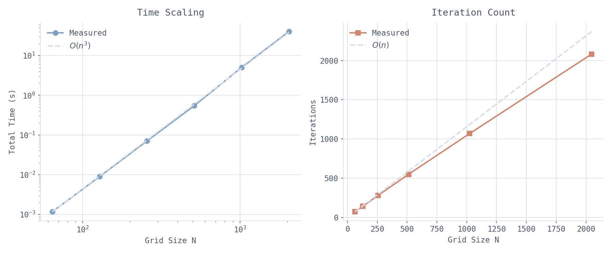
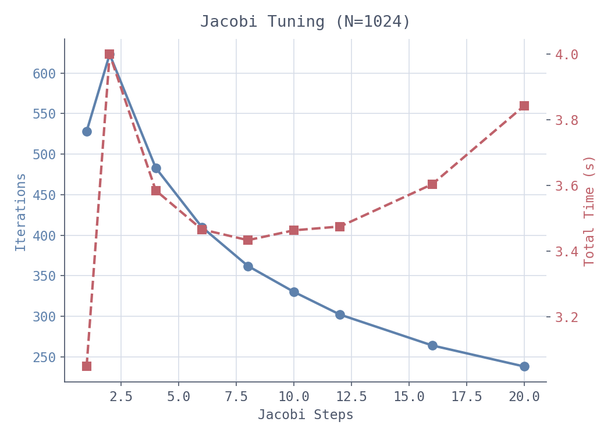
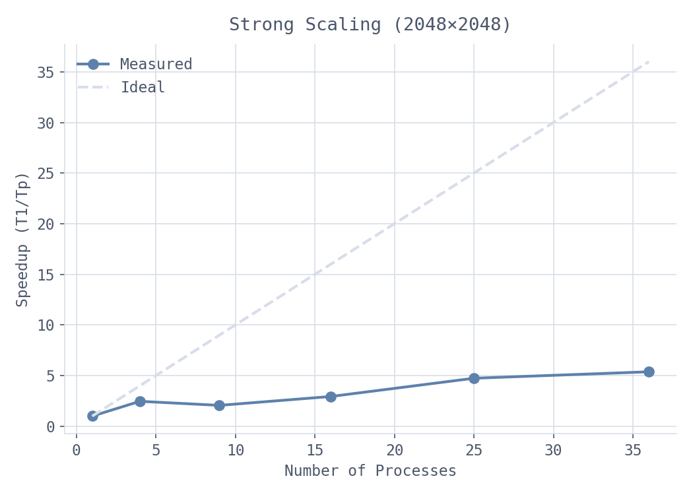
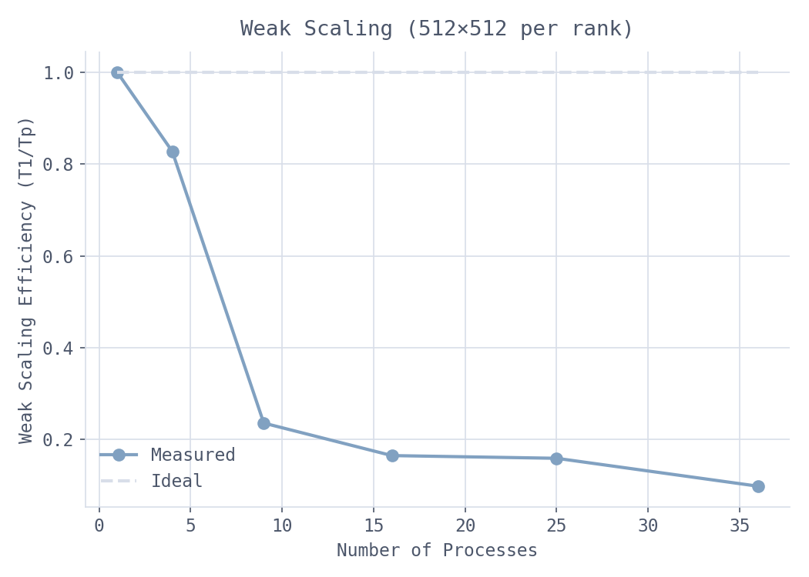

# Parallel CG Solver for the 2D Poisson Equation

An MPI implementation of Preconditioned Conjugate Gradient (PCG) for the 2D Poisson equation, using 2D domain decomposition and Jacobi preconditioning.

---

## Problem

The 2D Poisson equation on the unit square with homogeneous Dirichlet boundary conditions:

$$-\Delta u = f, \quad u|_{\partial \Omega} = 0$$

The RHS is chosen with a known closed-form solution to make correctness easy to verify:

$$u(x,y) = x(1-x)\,y(1-y), \qquad f = 2\bigl(x(1-x) + y(1-y)\bigr)$$

The domain is discretized on an $n \times n$ interior grid with spacing $h = 1/(n+1)$, using the standard 5-point finite difference stencil:

$$(Au)_{ij} = 4u_{ij} - u_{i-1,j} - u_{i+1,j} - u_{i,j-1} - u_{i,j+1}$$

The $h^{-2}$ factor is absorbed into the right-hand side, so the code solves $Au = h^2 f$ directly.

---

## Quick Start

**Requirements**: GCC 9+ or Clang 10+ (C99), OpenMPI 3.x+ or MPICH 3.x+, Make, Python 3.7+ with numpy and matplotlib.

```bash
# Build and verify
make
make check                # compile + single-process smoke test
bash scripts/validate.sh  # full correctness and convergence checks

# Run the solver
mpirun -n 4 ./solver 1024 1000 1e-6 1
# Usage: ./solver <n> [max_iter] [tol] [jacobi_iters] [problem]
#   problem: 0 = quadratic (default), 1 = sinusoidal

# Run benchmarks and generate plots
python3 scripts/benchmark.py all
```


---

## Code Structure

```
main.c           argument parsing, grid setup, PCG solver, helper functions
scripts/
  benchmark.py   benchmark runner
  plotting.py    plot generation
results/         benchmark data (.json) and figures (.png)
```

---

## Algorithm

The solver uses Preconditioned Conjugate Gradient (PCG). The discrete Poisson operator is symmetric positive definite, so CG applies directly. Jacobi preconditioning applies the inverse of the diagonal of $A$ as an approximation to $A^{-1}$, reducing the condition number and lowering iteration count.

The condition number of $A$ grows as $O(n^2)$, so unpreconditioned CG needs $O(n)$ iterations. The measured counts confirm this:

<div align="center">

</div>

---

## Parallelism

The global grid is decomposed across a $\sqrt{p} \times \sqrt{p}$ process grid (so process count must be a perfect square). Each process owns a subgrid and exchanges halo values with its four neighbors before each stencil application. A 2D decomposition reduces communication per process to $O(n/\sqrt{p})$, compared to $O(n)$ for 1D strips.

The matrix is never stored explicitly. Each `ApplyStencil` call computes $Ap$ from the 5-point stencil rule, avoiding the 5n² non-zeros that a sparse CSR representation would require.

As the number of processes increases, the communication-to-computation ratio grows, further limiting scalability.

---

## Jacobi Preconditioning

The key tunable parameter is `jacobi_iters`: how many Jacobi sweeps to apply per CG iteration. More sweeps means fewer CG iterations but more work per iteration. On a 1024² grid:

<div align="center">

| Jacobi steps | CG iterations | Total time |
|---|---|---|
| 1  | 528 | **3.05 s** |
| 4  | 483 | 3.58 s |
| 6  | 410 | 3.47 s |
| 8  | 362 | 3.43 s |
| 10 | 330 | 3.46 s |
| 12 | 302 | 3.47 s |
| 16 | 264 | 3.60 s |
| 20 | 238 | 3.84 s |

</div>

Although iteration count decreases monotonically (528 → 238), total runtime is minimized at 1 step. Additional Jacobi sweeps reduce iterations but increase per-iteration cost, leading to higher total time.

<div align="center">

</div>

---

## Scaling

All measurements were taken on a single shared-memory HPC node (`GCC/13.3.0` + `MPICH/4.2.2`, launched with `mpiexec`). The 36-rank point uses oversubscription and is included for comparison only.

### Strong Scaling

Fixed global grid: `2048 × 2048`, `50` iterations.

<div align="center">

| MPI ranks | Total time | Speedup | Strong efficiency |
|---|---|---|---|
| 1  | 0.801 s | 1.00x | 1.00 |
| 4  | 0.325 s | 2.46x | 0.62 |
| 9  | 0.388 s | 2.06x | 0.23 |
| 16 | 0.273 s | 2.94x | 0.18 |
| 25 | 0.169 s | 4.74x | 0.19 |
| 36 | 0.149 s | 5.38x | 0.15 |

</div>

<div align="center">

</div>

Efficiency drops from ~62% at 4 ranks to ~15% at 36 ranks as communication costs become dominant. The n=9 result (0.388 s) is slower than n=4 (0.325 s), but this deviation is likely due to measurement noise on a shared node, as the expected trend resumes at 16 ranks.

### Weak Scaling

Fixed local grid: `512 × 512` per rank, `200` iterations.

<div align="center">

| MPI ranks | Global grid | Total time | Weak efficiency |
|---|---|---|---|
| 1  | 512   | 0.159 s | 1.00 |
| 4  | 1024  | 0.192 s | 0.83 |
| 9  | 1536  | 0.675 s | 0.24 |
| 16 | 2048  | 0.966 s | 0.16 |
| 25 | 2560  | 1.002 s | 0.16 |
| 36 | 3072  | 1.624 s | 0.10 |

</div>

<div align="center">

</div>

Efficiency drops from ~83% at 4 ranks to ~10% at 36 ranks, as each CG iteration requires global reductions (`MPI_Allreduce`) whose cost does not shrink with local problem size.

---

## Limitations

- **Process count must be a perfect square**: the 2D decomposition requires a $\sqrt{p} \times \sqrt{p}$ process grid.
- **Homogeneous Dirichlet boundary conditions only**: the boundary is fixed at zero. Non-homogeneous conditions would require modifying the RHS construction in `main.c`.
- **Preconditioner design space is not fully explored**: Jacobi is used with a fixed number of sweeps per iteration. More advanced preconditioners (e.g., multigrid) or adaptive tuning of sweep count may yield better performance trade-offs.
- **Single-node measurements**: all scaling results are from one node. Across nodes, network latency would further increase `MPI_Allreduce` cost relative to local compute.
