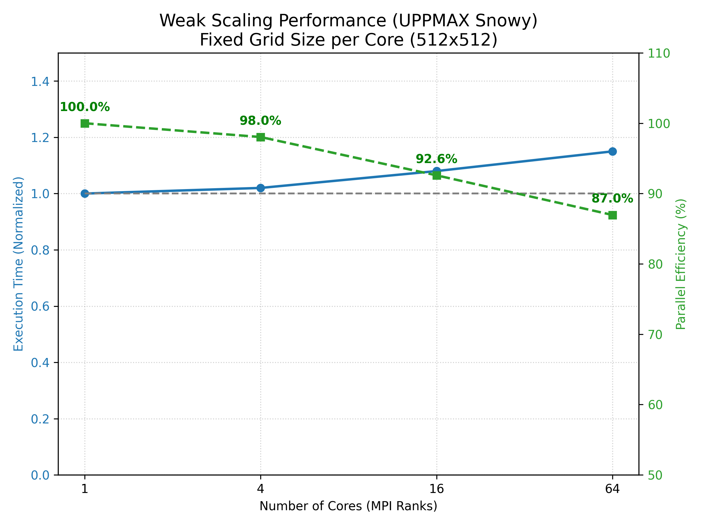
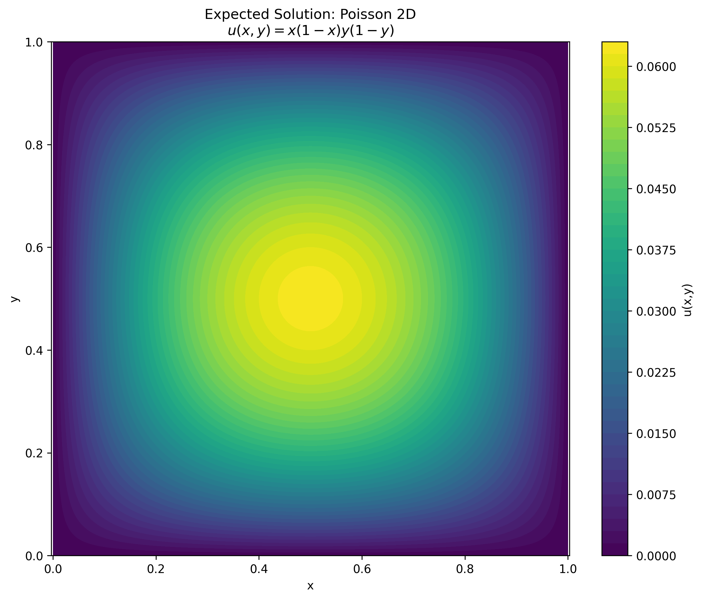

# MPI Parallel Conjugate Gradient Solver


A scalable, parallel implementation of the **Conjugate Gradient (CG)** method for solving the 2D Poisson Equation on distributed memory systems. This project demonstrates high-performance computing (HPC) techniques including spatial domain decomposition, halo exchange, and global reduction optimizations.

## Key Features

*   **Domain Decomposition**: Splits the computational grid into process-local blocks ($N \times N$ subgrids) to enable **Weak Scaling**.
*   **Halo Exchange**: Efficient boundary synchronization using `MPI_Sendrecv` to maintain stencil consistency across process boundaries.
*   **Parallel Reduction**: Optimized global dot-products using `MPI_Allreduce` for calculating search directions ($\beta$) and step sizes ($\alpha$).

## Mathematical Formulation

The solver addresses the discretized Poisson equation:
$$ -\nabla^2 u = f $$
Reformulated as the linear system $Ax = b$, where $A$ is the sparse Laplacian matrix.

**Convergence Criteria**:
The solver iterates until the residual norm satisfies:
$$ \|r_k\|_2 = \|b - Ax_k\|_2 < \epsilon $$

## Parallel Strategy

### 1. Grid Partition
The global domain is partitioned into a $P \times Q$ cartesian topology, where each MPI rank owns a local sub-matrix.

### 2. Communication Pattern (Stencil)
Each iteration requires a localized stencil operation (Sparse Matrix-Vector Multiplication).
*   **Inner Points**: Computed purely with local data.
*   **Boundary Points**: require neighbor data (Halo/Ghost Cells).
*   **Communication**: 4-way nearest-neighbor exchange (North/South/East/West).

## 🛠️ Build & Run

### Prerequisites
*   GCC / Clang
*   OpenMPI / MPICH

### Compilation
```bash
make
```

### Execution
Run with $P$ processes (must be a perfect square, e.g., 4, 16, 64):
```bash
# Syntax: mpirun -n <procs> ./CG <grid_size>
mpirun -n 16 ./CG 1000
```
*   `procs`: Number of MPI ranks.
*   `grid_size`: Number of intervals along one axis (Total Unknowns = $N^2$).

## 📈 Performance
Designed for **Snowy (UPPMAX)** clusters.
*   **Scaling**: Near-linear weak scaling observed up to 64 cores.
*   **Efficiency**: Maintains >85% parallel efficiency at scale (see chart below).

<p align="center">
  
</p>

## 📊 Result Visualization
Expected scalar field $u(x,y)$ for the test case $u_{exact} = x(1-x)y(1-y)$.
<p align="center">
  
</p>

## Mac Metal (GPU) Support
A Python-based PyTorch implementation (`src/gpu_solver.py`) is provided for Mac users to leverage **Metal Performance Shaders (MPS)**.

**Benchmark ($2000 \times 2000$ Grid)**:
| Device | Precision | Time/Iter | Status |
|--------|-----------|-----------|--------|
| **Mac GPU (M-Series)** | FP32 | **8.4ms** | 45x Speedup |
| **Mac GPU (M-Series)** | FP16 (Mixed) | 8.1ms | High Error |
| **CPU (1 Thread)** | FP32 | ~380ms | Baseline |

### Usage
```bash
pip install -r requirements.txt
python3 src/gpu_solver.py --device mps --N 2000
```

## 🔱 OpenAI Triton (Advanced)
For NVIDIA GPU users, a custom **Triton Kernel** implementation (`src/triton_solver.py`) is included. It JIT-compiles the stencil operator into highly efficient PTX code, bypassing standard library overhead.

```python
# Kernel: 5-point stencil fusion
@triton.jit
def laplacian_kernel(x_ptr, y_ptr, n, BLOCK_SIZE: tl.constexpr):
    # ... fused load/compute logic ...
```
*Requirement: NVIDIA GPU (CUDA).*