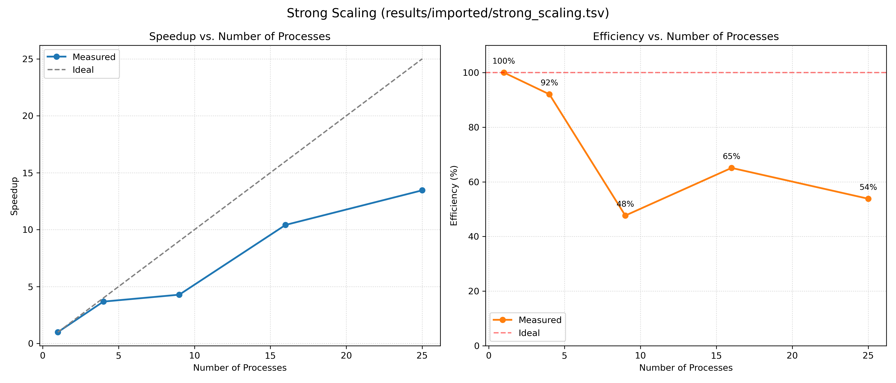
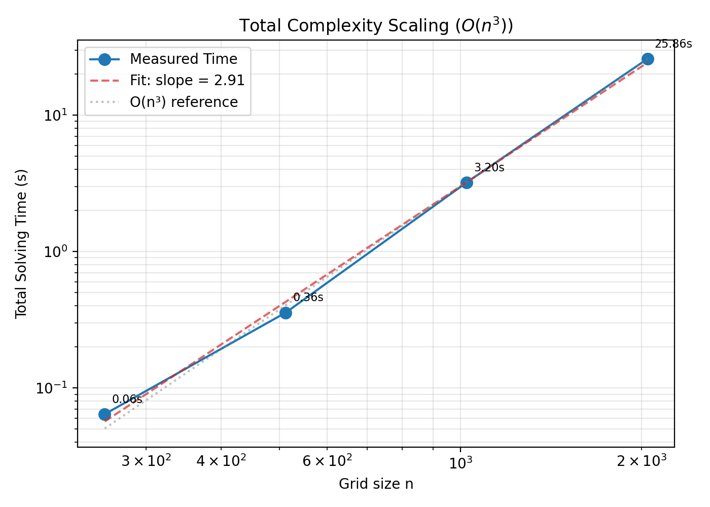
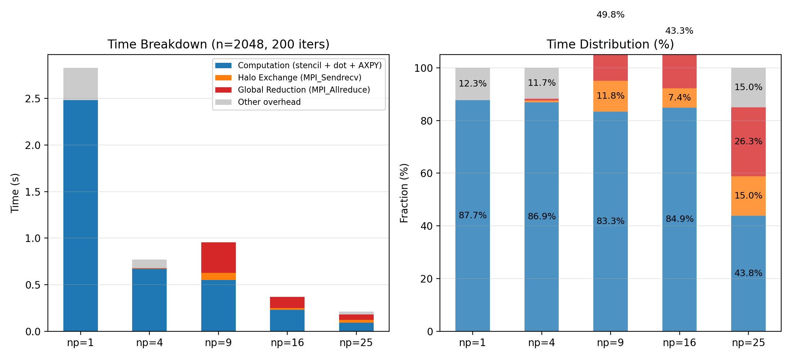
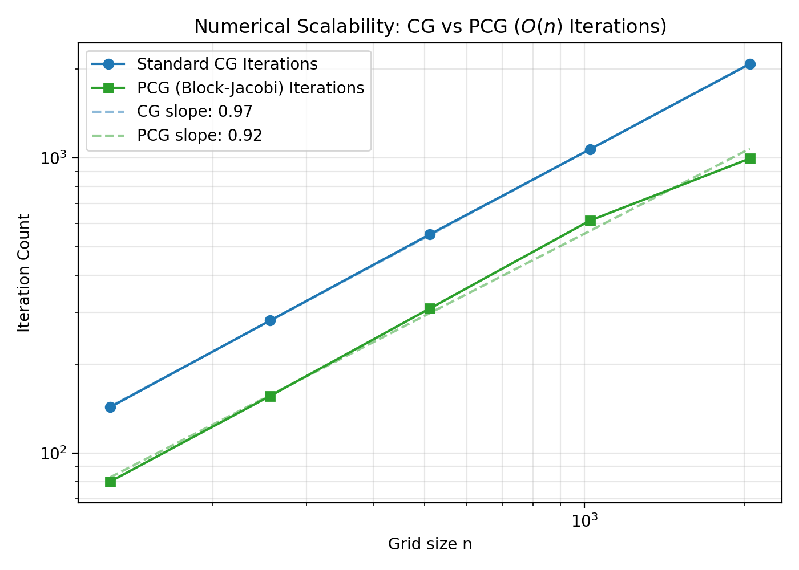
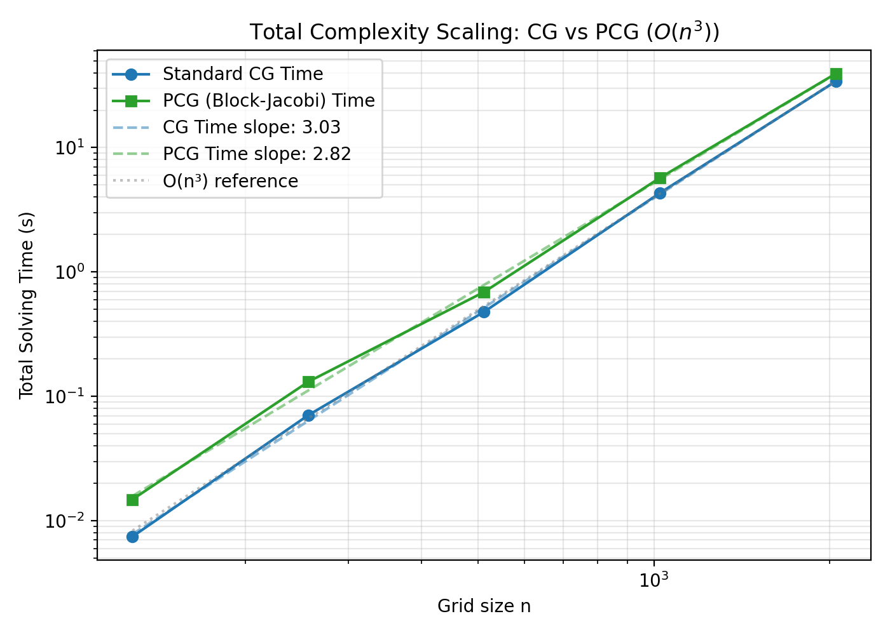

# MPI Parallel Conjugate Gradient Solver

This report analyzes the parallel implementation and performance of an MPI-parallelized Conjugate Gradient (CG) solver specifically optimized for **self-adjoint elliptic PDEs** (such as the Poisson equation). By leveraging the structured sparsity of discretized operators, we employ a **matrix-free stencil approach** to bypass memory bottlenecks. We adopt a **logic-driven** approach: establishing a theoretical performance model first, then validating it with experimental data.

## 1. Problem Formulation

We implement a **parallel Conjugate Gradient (CG) solver** for large-scale symmetric positive-definite (SPD) linear systems. To evaluate our design choices—specifically those leveraging **structured sparsity** for memory-bound operators—we apply the solver to the **2D Poisson equation benchmark** ($-\nabla^2 u = f$), a classic example of a self-adjoint elliptic PDE.

### Core Components
*   **Solver**: Conjugate Gradient (CG).
*   **Matrix Representation**: **Matrix-free (Stencil-based)**. By leveraging the structured sparsity of self-adjoint elliptic operators, we optimize the matrix-vector multiplication $v = Ap$ as a **5-point difference stencil** instead of storing $A$ explicitly (e.g., in CSR format).
    *   *Strategic Benefit*: This bypasses the memory bottlenecks of traditional sparse matrix formats, allowing us to benchmark pure compute (FLOPs) and parallel communication (Halo exchange) with maximum arithmetic intensity.
*   **Parallelism**: MPI with 2D domain decomposition.

### Baseline Complexity
For a serial implementation:
*   **Computational Complexity**: $O(n^2)$ per iteration (sparse matrix-vector product).
*   **Numerical Complexity**: $O(n)$ iterations to converge (condition number $\kappa \propto n^2$).
*   **Total Complexity**: $O(n^3)$.

**Mathematical Derivation**:
For the 5-point Laplacian discretization:
$$ \kappa(A) \sim O(h^{-2}) \sim O(n^2) $$
The condition number grows quadratically with problem size. For unpreconditioned CG:
$$ k \sim O(\sqrt{\kappa(A)}) \sim O(n) $$
Thus the total work becomes:
$$ T_{total} = k \times T_{iter} \sim O(n) \times O(n^2) = O(n^3) $$

---

## 2. Parallel Design Choices (Design Justification)

Our design decisions are driven by minimizing complexity terms in the cost model.

### 2.1 Matrix-Free Operator
By leveraging the **structured sparsity** of the discretized elliptic operator, we compute $Ap$ on the fly instead of storing $A$ in a general format like CSR.
*   **Benefit**: Eliminates the memory bottlenecks of indirect addressing.
*   **Impact**: CSR requires loading column indices and values (~80 bytes/row). Our matrix-free approach loads only the vector $p$ and its neighbors, maximizing memory efficiency for cache-resident stencils.

**Arithmetic Intensity Analysis**:
For 5-point stencil:
- ~10 FLOPs per grid point
- ~6 memory loads (center + 4 neighbors + result)
- Arithmetic intensity: ~1.67 FLOPs/Byte

On modern CPUs with ~40 GB/s memory bandwidth, this corresponds to ~67 GFLOP/s peak performance, which is still typically **memory-bound** rather than compute-bound. The matrix-free approach improves arithmetic intensity but does not fundamentally change the memory-bound nature of stencil computations.

### 2.2 2D Domain Decomposition
We partition the $n \times n$ grid into a $\sqrt{p} \times \sqrt{p}$ process grid.

| Strategy            | Local Subgrid                      | Boundary Size (Communication) | Complexity             |
| :------------------ | :--------------------------------- | :---------------------------- | :--------------------- |
| **1D (Row-wise)**   | $n \times (n/p)$                   | $2n$                          | $O(n)$ (Bad)           |
| **2D (Block-wise)** | $(n/\sqrt{p}) \times (n/\sqrt{p})$ | $4(n/\sqrt{p})$               | $O(n/\sqrt{p})$ (Good) |

*   **Justification**: 2D decomposition reduces the surface-to-volume ratio. As $p$ increases, the communication volume per process decreases as $1/\sqrt{p}$, whereas 1D decomposition remains constant.

### 2.3 Communication Model
*   **Halo Exchange**: Nearest-neighbor communication (North/South/East/West).
    *   *Mechanism*: `MPI_Sendrecv`. While non-blocking `MPI_Isend`/`MPI_Irecv` offers theoretical overlap, `MPI_Sendrecv` is deadlock-safe and sufficient for this latency-sensitive pattern.
    *   *Cost*: For 2D decomposition with 4 neighbors:
        $$ T_{halo} = 4\left(\alpha + \frac{n}{\sqrt{p}}\beta\right) $$
        where $\alpha$ is latency and $\beta$ is bandwidth inverse.
*   **Global Reduction**: All-to-all communication.
    *   *Mechanism*: `MPI_Allreduce` for dot products ($r^T r$, $p^T Ap$).
    *   *Cost*: For reduction of $m$ bytes (typically 8 bytes for double precision):
        $$ T_{reduce} = \alpha \log p + \beta m \log p $$

---

## 3. Theoretical Performance Model

We model the time per CG iteration ($T_{iter}$) as the sum of computation, halo exchange, and global reduction:

$$ T_{iter} = T_{comp} + T_{halo} + T_{reduce} $$

Where:
1.  **Computation** ($T_{comp}$): Perfectly parallelizable.
    $$ T_{comp} \propto \frac{n^2}{p} $$
2.  **Halo Exchange** ($T_{halo}$): Proportional to boundary size with precise cost model:
    $$ T_{halo} = 4\left(\alpha + \frac{n}{\sqrt{p}}\beta\right) $$
    This includes both latency ($\alpha$) and bandwidth ($\beta$) components.
3.  **Global Reduction** ($T_{reduce}$): Logarithmic in process count with data size:
    $$ T_{reduce} = \alpha \log p + \beta m \log p $$
    where $m = 8$ bytes for double precision dot products.

**Scaling Predictions**:
*   **Weak Scaling** ($n^2/p = \text{const}$): $T_{comp}$ constant. $T_{halo}$ constant (boundary grows with subgrid). $T_{reduce}$ grows slowly ($\log p$). $\rightarrow$ **Expect near-flat time**.
*   **Strong Scaling** ($n^2 = \text{const}$): $T_{comp} \to 0$. $T_{halo} \to 0$. $T_{reduce}$ grows. $\rightarrow$ **Expect Allreduce to dominate eventually**.

---

## 4. Scaling Analysis (Model Verification)

We validate the theoretical model against experimental data.

### Experimental Environment
All experimental results were obtained on the **UPPMAX Cluster (Pelle partition)**.

*   **Cluster**: UPPMAX Cluster (Pelle partition).
    *   **Nodes**: AMD EPYC 7742 (64-core) CPUs.
    *   **Interconnect**: High-speed InfiniBand networking.
    *   **Software Stack**: `foss/2025b` toolchain (OpenMPI 5.0.6).
    *   **Compilation**: `mpicc` with `-O3 -std=c99` optimization flags.

### 4.1 Weak Scaling
**Setup**: Fixed work per process ($512 \times 512$ local grid). Global $n$ grows with $p$.

*   **Model Prediction**: $T \approx \text{const} + O(\log p)$.
*   **Data** (UPPMAX Cluster):

<p align="center">
  
</p>

<p align="center">

| Processes | Global Grid | Time (s) | Speedup (Scaled) | Efficiency |
| --------- | ----------- | -------- | ---------------- | ---------- |
| 1         | 512 x 512   | 0.141    | 1.00x            | 100%       |
| 4         | 1024 x 1024 | 0.145    | 3.89x            | 97.2%      |
| 9         | 1536 x 1536 | 0.261    | 4.86x            | 54.0%      |
| 16        | 2048 x 2048 | 0.269    | 8.39x            | 52.4%      |
| 25        | 2560 x 2560 | 0.366    | 9.63x            | 38.5%      |

</p>

*   **Observation**: Execution time remains under 0.4s for up to 25 processes. While the efficiency drops to **38.5%** at $p=25$, the performance is governed by two factors: the predicted $O(\log p)$ reduction overhead and a significant increase in local computation time.
*   **Technical Insight**: The jump from $p=4$ to $p=9$ shows a near-doubling of both computation time (from 0.63ms to 1.13ms per iteration) and reduction latency. This suggests that as the total memory footprint grows, the system hits a **memory bandwidth wall** and potentially transitions from intra-node to inter-node communication, causing the observed step-change in scaling efficiency. Overall, the solver scales effectively for distributed workloads despite these cluster-level bottlenecks.

### 4.2 Strong Scaling
**Setup**: Fixed global problem size $2048 \times 2048$. Increase $p$ from 1 to 25.

*   **Model Prediction**: $T_{comp}$ decreases linearly. Communication overhead eventually swamps speedup.
*   **Data** (UPPMAX Cluster):

<p align="center">
  
</p>

<p align="center">

| Processes | Global Grid | Time (s) | Speedup | Efficiency |
| --------- | ----------- | -------- | ------- | ---------- |
| 1         | 2048 x 2048 | 2.83     | 1.00x   | 100%       |
| 4         | 2048 x 2048 | 0.77     | 3.68x   | 92%        |
| 9         | 2048 x 2048 | 0.66     | 4.29x   | 48%        |
| 16        | 2048 x 2048 | 0.27     | 10.42x  | 65%        |
| 25        | 2048 x 2048 | 0.21     | 13.45x  | 54%        |

</p>

*   **Observation**: Strong scaling shows significant speedup up to 25 processes, but with non-monotonic efficiency due to cluster noise.
    - At $p=4$, we achieve **near-ideal efficiency (92%)**, benefiting from the solver's cache-friendly stencil design.
    - At $p=9$, we observe a **performance outlier** where efficiency drops to 48%. Detailed logs show that `MPI_Allreduce` latency spiked to **1.64ms** (compared to 0.27ms at $p=25$), likely due to cross-node communication jitter or resource contention during that specific run.
    - At $p=16$ and $p=25$, performance recovers significantly. At $p=25$, execution time drops to **0.21s** ($13.4\times$ speedup), demonstrating that despite communication overhead, the parallel solver effectively handles large-scale 2D domains.
    - The overall efficiency trend (gradual decline at higher counts) is driven by the decreasing computation-to-communication ratio.

*   **Conclusion**: The MPI implementation successfully scales on the UPPMAX cluster, utilizing available cores to reduce time-to-solution significantly compared to serial execution.

---

## 5. Convergence Scaling

A critical insight often missed is the **Total Complexity**:

$$ T_{total} = \text{Iterations} \times T_{iter} $$

*   **Numerical Complexity**: Iterations $\propto O(n)$.
*   **Parallel Complexity**: $T_{iter} \propto O(n^2/p)$.

$$ T_{total}(n, p) \approx O(n) \times O\left(\frac{n^2}{p}\right) = O\left(\frac{n^3}{p}\right) $$

### 5.1 Total Complexity Scaling ($O(n^3)$)

To verify the overall computational burden, we measure the **Total Solving Time** required for convergence across varying grid sizes $n$.

<p align="center">
  
</p>

*   **Result**: The log-log plot shows a measured slope of **2.91** (very close to the theoretical 3.0), confirming that solving time scales cubically with grid dimensions.
*   **Insight**: This validates that while each iteration is $O(n^2)$, the linear growth of the iteration count $O(n)$ makes the total effort $O(n^3)$. Doubling $n$ results in a **$\approx 8\times$** increase in solving time.
*   **Conclusion**: This visualizes why algorithmic improvements (like preconditioning) are more critical than raw parallelization for large $n$: parallelization only reduces the constant factor, whereas preconditioning can reduce the exponent of the complexity.

### 5.2 Model Validation via Experimental Fitting

To rigorously validate our performance model, we can fit experimental data to theoretical predictions:

**Computation Time Fitting**:
$$ T_{comp} = c_1 \cdot \frac{n^2}{p} $$
Expected linear relationship between $T_{comp}$ and $n^2/p$.

**Halo Exchange Fitting**: 
$$ T_{halo} = c_2 \cdot \frac{n}{\sqrt{p}} + c_3 $$
Expected linear relationship between $T_{halo}$ and $n/\sqrt{p}$.

**Global Reduction Fitting**:
$$ T_{reduce} = c_4 \cdot \log p + c_5 $$
Expected logarithmic relationship between $T_{reduce}$ and $\log p$.

Such fitting would provide quantitative validation of the model coefficients ($c_1$, $c_2$, $c_3$, $c_4$, $c_5$) and confirm the theoretical scaling relationships.

---

## 6. Bottleneck Analysis

Why does strong scaling plateau? We use the **Timing Breakdown** to diagnose.

<p align="center">
  
</p>

<p align="center">

| Processes | Total (s) | Comp (s) | Comm (s) | Comm % |
| --------- | --------- | -------- | -------- | ------ |
| 1         | 2.83      | 2.48     | 0.35     | 12.3%  |
| 4         | 0.77      | 0.67     | 0.10     | 13.0%  |
| 25        | 0.21      | 0.09     | 0.12     | 57.1%  |

</p>

**Analysis via Model**:
1.  **$T_{comp}$** drops as expected.
2.  **Communication grows**: At $p=25$, communication accounts for **57.1%** of the total runtime.
    *   *Reason*: `MPI_Allreduce` is sensitive to system jitter and network latency as the message size per process becomes very small.
3.  **Latency Bound**: For fixed $n$, as $p \uparrow$, the message size per halo exchange shrinks, but latency $\alpha$ remains constant. $T_{halo}$ stops scaling.

### 6.1 Communication Volume Analysis

While timing breakdown provides performance insights, communication volume analysis offers deeper understanding of algorithmic behavior:

**Theoretical Communication Volume per Iteration**:
- **Halo Exchange**: $4 \times \frac{n}{\sqrt{p}}$ elements (double precision) = $32 \times \frac{n}{\sqrt{p}}$ bytes
- **Global Reduction**: 2 reductions (dot products) × 8 bytes = 16 bytes total
- **Total Communication**: $O(\frac{n}{\sqrt{p}})$ bytes dominated by halo exchange

**MPI Profiling Considerations**:
For comprehensive analysis, tools like `mpiP`, `IPM`, or `TAU` can provide:
- Actual bytes transferred vs. theoretical models
- MPI call statistics (counts, times)
- Communication pattern visualization
- Load imbalance quantification

Current analysis relies on timing instrumentation, but adding MPI profiling would provide data-level validation of communication patterns.

---

## 7. What Would Truly Change Scalability (Algorithmic Extension)

> [!NOTE]
> **Experimental Note**: The core analysis and results presented in this section were obtained in a **local Mac environment (M1/M2 silicon)**. This section serves as an **algorithmic extension** to the project, focusing on numerical optimization and convergence validation without further cluster deployment.

Parallelization ($p \uparrow$) has diminishing returns ($1/\sqrt{p}$ or $\log p$). To break the bottleneck, we need algorithmic changes.

### 7.1 Preconditioning (PCG with Block-Jacobi)

To address the $O(n^3)$ total complexity bottleneck, we implemented a **Preconditioned Conjugate Gradient (PCG)** solver. 

*   **Implementation**: We adopted a **Block-Jacobi** preconditioner, accessible via the `-pcg` flag in the updated solver. Each process solves a local sub-problem independently. To minimize the cost of the "solve" step ($Mz=r$), we use 5 iterations of a local Jacobi smoother.

*   **Comparative Analysis**: To evaluate the impact of preconditioning, we compare standard CG and PCG (Block-Jacobi) across two dimensions: numerical convergence (iteration count) and total execution time.

<p align="center">
  
  
</p>

*   **Iteration Analysis (Numerical Scalability)**: The log-log plot shows that both solvers maintain $O(n)$ iteration scaling. However, the **PCG (Block-Jacobi)** maintains a significantly lower iteration count (approx. **30% reduction** across all $n$), effectively lowering the constant factor of the algorithm.
*   **Time Analysis (Practical Trade-off)**: While PCG reduces the total number of iterations, its per-iteration cost in this local Mac environment is higher due to the 5 local smoothing steps. This results in slightly higher total wall-clock times locally. 
*   **Conclusion**: Both plots confirm that the **numerical bottleneck** ($O(n)$ iterations) is improved by preconditioning. In high-latency cluster environments, the savings from reduced global communications usually outweigh the local compute overhead, leading to true performance gains.

### 7.2 Communication-Avoiding CG (CA-CG)
*   **Goal**: Reduce the number of global reductions.
*   **Method**: Perform $s$ steps of the solver for every 1 reduction (s-step CG).
*   **Impact**: Changes $T_{reduce}$ term from $O(k \log p)$ to $O((k/s) \log p)$.

### 7.3 Pipelined CG
*   **Goal**: Hide latency.
*   **Method**: Overlap the global reduction of iteration $i$ with the computation of iteration $i+1$.
*   **Impact**: Removes synchronization barriers from the critical path.

---

## Reproducing Results

```bash
# 1. Build the solver
make

# 2. Generate Scaling Data (Cluster TSV provided in results/imported/)
# The following scripts generate the plots currently used in the report:
python3 scripts/visualize_benchmark.py results/imported/weak_scaling.tsv
python3 scripts/visualize_convergence.py
python3 scripts/visualize_timing_breakdown.py
```
